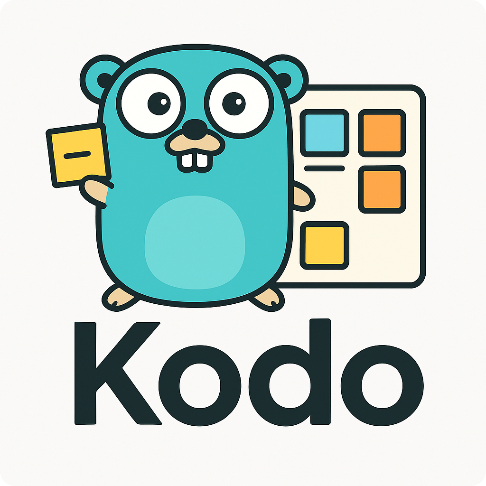

<div align="center">
    
</div>

<p align="center" style="margin-top: 12px">
  <b>Agile Kanban & Notes for Developers</b>
</p>

**Kodo** is a modern, source-code-focused Kanban board and notes app for your source-code. It streamlines software project management for technical teams by combining task tracking, code scanning, note saving, and a customizable workspace.

## Features

- **Kanban Board:**  
  Organize tasks into customizable columns, drag and drop cards, set priorities, and visualize workflow from "Todo" to "Done".

- **Code Issue Scanning:**  
  Automatically scan your codebase for TODOs, FIXMEs, BUGs, and custom patterns.

- **Notes:**  
  Add notes and documentation directly in your codebase.

- **Workspace Customization:**  
  Personalize your board with themes, colors, and...

## Getting Started

### Prerequisites
- Go
- git

### Installation
```bash
go install github.com/prodemmi/kodo@latest
```

## 🤝 Contributing

1. Fork the project.
2. Create your feature branch (`git checkout -b feature/my-feature`).
3. Commit your changes (`git commit -am 'Add feature'`).
4. Push to the branch (`git push origin feature/my-feature`).
5. Open a Pull Request.

## 📝 License

This project is open-source and available under the [MIT License](LICENSE).

---

<p align="center">
  <i>Built for productivity. Designed for devs.</i>
</p>